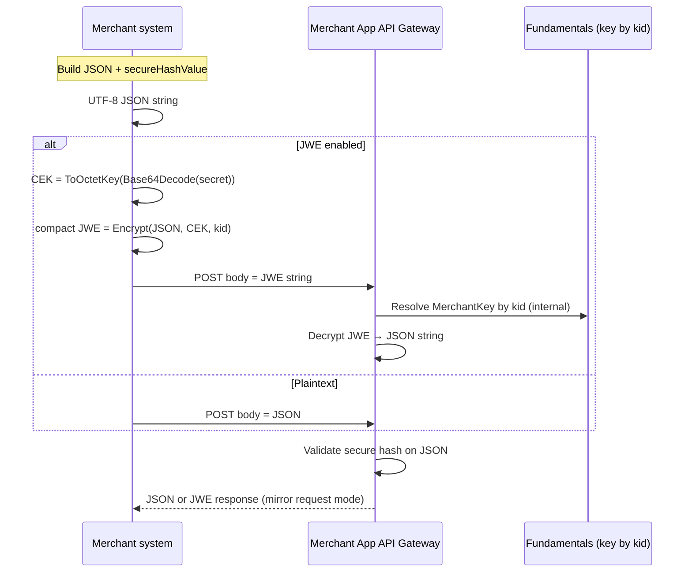

# Webhook End-to-End Encryption (JWE) — Implementation Guide

**Audience:** integration engineers, security reviewers, and backend developers connecting merchant systems to Amwal Pay webhook APIs.

**Scope:** optional **JSON Web Encryption (JWE)** in **compact serialization** for HTTP request and response bodies on the **Merchant App API Gateway** webhook pipeline. This layer is **in addition to** TLS (transport) and the existing **secure hash (HMAC)** on the JSON payload after decryption.

**Version note:** behavior described here matches the gateway middleware (`WebhookSecureHashMiddleware`), CEK normalization (`WebhookJweDirectKey`), and the dev helper `WebhookJweSimulatorController` in **APG.MerchantAppApiGateway**.

---

## Table of contents

1. [Why end-to-end encryption](#1-why-end-to-end-encryption)
2. [Threat model and what JWE does / does not do](#2-threat-model-and-what-jwe-does--does-not-do)
3. [Before vs after (conceptual)](#3-before-vs-after-conceptual)
4. [Cryptographic contract](#4-cryptographic-contract)
5. [Key material (CEK) derivation](#5-key-material-cek-derivation-must-match-gateway)
6. [Step-by-step: building an encrypted webhook request](#6-step-by-step-building-an-encrypted-webhook-request)
7. [Step-by-step: gateway processing](#7-step-by-step-gateway-processing)
8. [Encrypted responses](#8-encrypted-responses)
9. [Policy: merchant must send JWE when E2E is enabled](#9-policy-merchant-must-send-jwe-when-e2e-is-enabled)
10. [Error handling reference](#10-error-handling-reference)
11. [Language examples: encrypt and decrypt](#11-language-examples-encrypt-and-decrypt)
12. [Local testing with the gateway simulator](#12-local-testing-with-the-gateway-simulator)
13. [Operational checklist](#13-operational-checklist)
14. [References](#14-references)

---

## 1. Why end-to-end encryption

| Concern | TLS alone | TLS + JWE body |
|--------|-----------|----------------|
| Payload visible inside your DMZ / proxies that terminate TLS | Possible | ciphertext until your app decrypts |
| Payload visible at shared logging / WAF that stores body | Often yes | ciphertext if logging raw body |
| Compliance ask for “payload confidentiality” between merchant and acquirer | Partial | Stronger story with JWE |

JWE encrypts the **application JSON string** (UTF-8 bytes) you would have sent as the raw body. After the gateway **decrypts**, it still validates **`secureHashValue`** exactly as for plaintext webhooks.

---

## 2. Threat model and what JWE does / does not do

**Does:**

- Hides webhook JSON from intermediaries that see the HTTP body before your gateway decrypts (subject to correct key handling on your side).
- Binds decryption to a **specific symmetric key row** via JWE **`kid`** (must match the **Merchant Key** UUID in Fundamentals).

**Does not:**

- Replace **secure hash** — after decryption the gateway expects the same JSON fields and a valid **`secureHashValue`**.
- Replace **TLS** — always use HTTPS.
- Authenticate the **caller** by itself — pairing TLS, IP allowlists, and secure hash remains important.

---

## 3. Before vs after (conceptual)

### 3.1 Before (plaintext webhook body)

**HTTP**

```http
POST /YourWebhookPath HTTP/1.1
Host: merchant-app-gateway.example
Content-Type: application/json

{"merchantId":"12345","amount":"10.000", "...":"...","secureHashValue":"..."}
```

**Characteristics**

- Body is JSON.
- Gateway reads JSON, loads merchant, validates secure hash, routes downstream.

### 3.2 After (JWE webhook body)

**HTTP**

```http
POST /YourWebhookPath HTTP/1.1
Host: merchant-app-gateway.example
Content-Type: text/plain

eyJhbGciOi...first.header....eyJ...encrypted.key....iv....ciphertext....tag
```

**Characteristics**

- Body is a **single compact JWE string** (five Base64URL segments separated by `.`).
- Gateway detects JWE, decrypts with key looked up by **`kid`**, replaces request body with **decrypted UTF-8 JSON**, then runs the same secure hash and business logic as plaintext.

### 3.3 Side-by-side (logical)

| Aspect | Plaintext | JWE |
|--------|-----------|-----|
| `Content-Type` | typically `application/json` | often `text/plain` or raw string (match your deployment) |
| Body | JSON object | compact JWE string |
| `secureHashValue` | over JSON fields | over **same** JSON fields **after** decrypt |
| Response body (when gateway encrypts reply) | JSON | compact JWE string |

### 3.4 End-to-end data flow (mermaid)



---

## 4. Cryptographic contract

| Parameter | Value |
|-----------|--------|
| Serialization | **JWE compact** ([RFC 7516](https://www.rfc-editor.org/rfc/rfc7516)) |
| `alg` | **`dir`** — direct use of the content encryption key |
| `enc` | **`A128CBC-HS256`** ([RFC 7518](https://www.rfc-editor.org/rfc/rfc7518)) |
| **`kid` (required)** | **UUID string** equal to the **Merchant Key** row’s **Id** (same value shown as “JWE kid” in the portal). Must appear in the JWE **protected** header so the gateway can load the secret from Fundamentals. |
| CEK input | Base64-decoded **secret key** bytes from the portal (Merchant Key). |
| CEK length | **32 bytes** after normalization (see [§5](#5-key-material-cek-derivation-must-match-gateway)). |

**Plaintext to encrypt:** the **exact UTF-8 string** of the JSON document you would have posted as the body (including field order if your HMAC canonicalization depends on it — follow the published secure-hash rules).

---

## 5. Key material (CEK derivation) — must match gateway

Gateway code path (conceptual):

1. Base64-decode the portal **Secret key** → `secretKeyMaterial` (byte array).
2. If `secretKeyMaterial.Length == 32` → use as CEK.
3. Else → **`CEK = SHA256(secretKeyMaterial)`** (32 bytes).

This matches `WebhookJweDirectKey.ToOctetKey` in the gateway.

**Example**

| Portal secret (Base64) | Decoded length | CEK used for JWE |
|------------------------|----------------|-----------------|
| 44 chars → decodes to 32 bytes | 32 | those 32 bytes |
| Longer / shorter random material | ≠ 32 | SHA-256 hash (32 bytes) |

---

## 6. Step-by-step: building an encrypted webhook request

### Step 1 — Build the same JSON as today (plaintext reference)

**Before (object you sign and send as JSON):**

```json
{
  "merchantId": "10001",
  "amount": "15.500",
  "currency": "OMR",
  "secureHashValue": "COMPUTED_HMAC_PER_PUBLISHED_RULES"
}
```

**After (same object):** unchanged at the **logical** level — you still compute **`secureHashValue`** over the same field set.

### Step 2 — Serialize to a string (critical)

- Produce **`payloadString`** = JSON **as you will verify for hashing** (stable field ordering per your integration guide).
- **UTF-8** encode that string for encryption input.

**Before (wire as JSON):** the HTTP body **is** that string (modulo `Content-Type`).

**After (wire as JWE):** the HTTP body **is** `JWE_compact = Encrypt(payloadString, CEK, headers)`.

### Step 3 — Build protected header (conceptually segment 1 after encoding)

Minimum required custom header for this integration:

```json
{
  "alg": "dir",
  "enc": "A128CBC-HS256",
  "kid": "3fa85f64-5717-4562-b3fc-2c963f66afa6"
}
```

`kid` **must** equal the **Merchant Key Id** UUID from the portal.

### Step 4 — Encrypt

Use a vetted JWE library (see [§11](#11-language-examples-encrypt-and-decrypt)) with:

- Algorithm: **dir**
- Encryption: **A128CBC-HS256**
- Key: **32-byte CEK** from [§5](#5-key-material-cek-derivation-must-match-gateway)

**Final output (example shape only — do not use in production):**

```text
eyJhbGciOiJkaXIiLCJlbmMiOiJBMTI4Q0JDLUhTMjU2Iiwia2lkIjoiM2ZhODVmNjQtNTcxNy00NTYyLWIzZmMtMmM5NjNmNjZhZmE2In0
.
.
.
.
.
```

Compact JWE has **five segments** separated by **four** dots (`.`).

### Step 5 — HTTP POST

- **Body:** raw compact JWE string (no JSON wrapper).
- **URL / path:** same webhook path as plaintext.
- **TLS:** required in production.

### Appendix A — Worked example: before / after each step (illustrative)

Assume portal **Merchant Key**:

| Field | Example value |
|-------|-----------------|
| `kid` (key Id) | `3fa85f64-5717-4562-b3fc-2c963f66afa6` |
| Secret (Base64) | `Mj...` (32 random bytes when decoded → CEK = raw 32 bytes) |

**Step A — Canonical JSON string (before secure hash)**

*Before:* (pretty, not yet what you hash)

```json
{
  "merchantId": "10001",
  "amount": "1.000"
}
```

*After:* (single **minified** string `payloadA` — many teams use minified form for hashing; follow your published secure-hash rules exactly)

```text
{"merchantId":"10001","amount":"1.000"}
```

**Step B — Append `secureHashValue`**

*Before:*

```text
{"merchantId":"10001","amount":"1.000"}
```

*After:* `payloadB` (UTF-8 string you will encrypt — **this is the JWE plaintext**)

```text
{"merchantId":"10001","amount":"1.000","secureHashValue":"a1b2c3d4e5f6..."}
```

**Step C — CEK derivation**

*Before:* Base64 secret string from portal.

*After:* 32-byte `CEK` (either decoded bytes if length 32, or `SHA256(decoded)`).

**Step D — JWE encrypt `payloadB`**

*Before:* plaintext UTF-8 bytes of `payloadB`.

*After:* **one** ASCII string, **five** Base64URL segments (dots between). Example **structure only** (values will differ every run):

```http
POST /webhook/your-endpoint HTTP/1.1
Host: <gateway-host>
Content-Type: text/plain
Content-Length: <len>

eyJhbGciOiJkaXIiLCJlbmMiOiJBMTI4Q0JDLUhTMjU2Iiwia2lkIjoiM2ZhODVmNjQtNTcxNy00NTYyLWIzZmMtMmM5NjNmNjZhZmE2In0.<IV>.<CIPHERTEXT>.<AUTH_TAG>
```

(Real compact JWE has **five** dot-separated segments; angle-bracket labels are placeholders for the three encrypted parts.)

**Step E — Gateway decrypt (logical “after” on the server)**

*Before:* raw body = JWE string above.

*After:* inner string equals **`payloadB`** again; gateway then parses JSON and validates **`secureHashValue`**.

**Step F — Response (when gateway encrypts the response)**

*Before (downstream JSON string):*

```json
{"success":true,"responseCode":"00","data":null}
```

*After (wire to your client):* compact JWE built with the **same CEK** — decrypt with your key + `dir` / `A128CBC-HS256` to recover the JSON.

---

## 7. Step-by-step: gateway processing

1. Read raw body string.
2. Try interpret as compact JWE: parse header, read **`kid`** as GUID.
3. If not a JWE / cannot parse → treat as **plaintext** (subject to E2E policy — [§9](#9-policy-merchant-must-send-jwe-when-e2e-is-enabled)).
4. Load **MerchantKey** by `kid`; derive **CEK** with `ToOctetKey`.
5. **Decrypt** → UTF-8 JSON string.
6. Replace `HttpContext.Request.Body` with decrypted bytes; set `Content-Type: application/json` for downstream.
7. Deserialize JSON; read **`merchantId`**; load merchant cache.
8. If request was JWE: validate **`kid`** row’s `MerchantRefId` matches merchant’s **`MerchantRefId`** (anti cross-merchant key confusion).
9. Validate **secure hash** on decrypted JSON (unless disabled in specific non-prod configs).
10. Continue pipeline (Ocelot / downstream APIs).

---

## 8. Encrypted responses

When the **incoming** webhook was successfully decrypted as JWE:

- The gateway may **encrypt** the **response body** with the **same CEK** using **`dir` + `A128CBC-HS256`** and return it as a compact JWE string (implementation uses `JWT.Encode` with `application/jose`-style handling in middleware).

**Merchant obligation:** if you sent JWE, be prepared to **decrypt** the response with the **same symmetric key** and algorithm suite.

**Before (response):**

```json
{"success":true,"data":{}}
```

**After (response, illustrative):**

```text
eyJ...compact.jwe.five.parts...
```

---

## 9. Policy: merchant must send JWE when E2E is enabled

When the merchant record has **`IsE2EEncryption`** enabled in Fundamentals (and the gateway’s cached `MerchantViewModel` reflects it):

- If the raw body is **not** successfully processed as JWE (`isEncryptedRequest == false`), the gateway returns **HTTP 400** with **`ResponseCode: BusinessException`** and message **`WebhookEncryptedBodyRequired`**.

This is enforced in **`WebhookSecureHashMiddleware`** after the merchant is resolved from `merchantId`.

---

## 10. Error handling reference

| Situation | Typical HTTP | `ResponseCode` (conceptual) | Notes |
|-----------|--------------|-------------------------------|--------|
| E2E enabled, body not JWE | 400 | BusinessException | `WebhookEncryptedBodyRequired` |
| JWE `kid` resolves to a key for another merchant | 401 | TechnicalException | `WebhookEncryptionKeyMerchantMismatch` |
| Invalid secure hash on decrypted JSON | 401 | TechnicalException | `InvalidHashing` |
| Missing `merchantId` / invalid JSON | 400 | BusinessException | various |

Exact JSON envelope follows your gateway’s **`ResponseModel`** shape (`success`, `message`, `errorList`, `responseCode`).

---

## 11. Language examples: encrypt and decrypt

> **Important:** all examples must implement **CEK = `ToOctetKey(base64Decode(secret))`** exactly as in [§5](#5-key-material-cek-derivation-must-match-gateway). Test against **`POST /webhook-simulator/encrypt`** and **`POST /webhook-simulator/decrypt`** on a dev gateway when available.

### 11.1 C# (.NET) — aligned with production gateway

Uses **`jose-jwt`** (same family as `JWT.Encode` / `JWT.Decode` in `WebhookJweSimulatorController`).

```csharp
using System;
using System.Collections.Generic;
using System.Security.Cryptography;
using System.Text;
using Jose;

public static class WebhookJweClient
{
    /// <summary>Matches APG.MerchantAppGateway.Crypto.WebhookJweDirectKey.ToOctetKey</summary>
    public static byte[] ToOctetKey(byte[] secretKeyMaterial)
    {
        if (secretKeyMaterial.Length == 32)
            return secretKeyMaterial;
        return SHA256.HashData(secretKeyMaterial);
    }

    public static string EncryptPayload(string plaintextUtf8Json, string secretKeyBase64, Guid kid)
    {
        var material = Convert.FromBase64String(secretKeyBase64.Trim());
        var cek = ToOctetKey(material);

        var extraHeaders = new Dictionary<string, object> { ["kid"] = kid.ToString() };
        return JWT.Encode(
            plaintextUtf8Json,
            cek,
            JweAlgorithm.DIR,
            JweEncryption.A128CBC_HS256,
            extraHeaders: extraHeaders);
    }

    public static string DecryptCompactJwe(string compactJwe, string secretKeyBase64)
    {
        var material = Convert.FromBase64String(secretKeyBase64.Trim());
        var cek = ToOctetKey(material);
        return JWT.Decode(compactJwe, cek);
    }
}
```

**Example call**

```csharp
var kid = Guid.Parse("019dede9-bd80-7eb7-a5f1-8e5a5f146485");
var secretFromPortal = "YOUR_BASE64_SECRET_KEY";
var json = """{"merchantId":"10001","amount":"1.000","secureHashValue":"..."}""";

var jwe = WebhookJweClient.EncryptPayload(json, secretFromPortal, kid);
Console.WriteLine(jwe);

var roundTrip = WebhookJweClient.DecryptCompactJwe(jwe, secretFromPortal);
Console.WriteLine(roundTrip);
```

### 11.2 Node.js (JavaScript) — `@panva/jose`

Install: `npm install jose`

Derive the **32-byte CEK** exactly as in [§5](#5-key-material-cek-derivation-must-match-gateway). Recent `@panva/jose` builds allow passing that **`Uint8Array`** (length 32) to **`CompactEncrypt.encrypt()`** for **`alg: dir`** with **`enc: A128CBC-HS256`**. Library APIs differ by major version—**always round-trip against `POST /webhook-simulator/encrypt`** on your gateway branch before production.

```javascript
import crypto from 'crypto';
import { CompactEncrypt, compactDecrypt } from 'jose';

function toOctetKey(secretKeyMaterial) {
  if (secretKeyMaterial.length === 32) return secretKeyMaterial;
  return crypto.createHash('sha256').update(secretKeyMaterial).digest(); // 32 bytes
}

/** @param {string} secretKeyBase64 from portal */
export async function encryptWebhookBody(plaintextUtf8, secretKeyBase64, kidUuidString) {
  const material = Buffer.from(secretKeyBase64.trim(), 'base64');
  const cek = new Uint8Array(toOctetKey(material));

  return await new CompactEncrypt(new TextEncoder().encode(plaintextUtf8))
    .setProtectedHeader({ alg: 'dir', enc: 'A128CBC-HS256', kid: kidUuidString })
    .encrypt(cek);
}

export async function decryptWebhookBody(compactJwe, secretKeyBase64) {
  const material = Buffer.from(secretKeyBase64.trim(), 'base64');
  const cek = new Uint8Array(toOctetKey(material));
  const { plaintext } = await compactDecrypt(compactJwe, cek);
  return new TextDecoder().decode(plaintext);
}
```

> If `encrypt(cek)` throws (type mismatch), import a JWK oct key per your `jose` version or **use the C# simulator HTTP endpoint** as the encryption oracle in CI.

### 11.3 Python 3 — `jwcrypto`

Install: `pip install jwcrypto`

Use **`json_encode`** for the protected header (per [jwcrypto JWE examples](https://jwcrypto.readthedocs.io/en/latest/jwe.html)). Validate output against **`/webhook-simulator/encrypt`**; header field names are case-sensitive.

```python
import base64
import hashlib
from uuid import UUID

from jwcrypto import jwe, jwk
from jwcrypto.common import base64url_encode, json_encode


def to_octet_key(secret_key_material: bytes) -> bytes:
    if len(secret_key_material) == 32:
        return secret_key_material
    return hashlib.sha256(secret_key_material).digest()


def encrypt_webhook_body(plaintext_json_str: str, secret_key_base64: str, kid: UUID) -> str:
    raw = base64.b64decode(secret_key_base64.strip())
    cek = to_octet_key(raw)
    key = jwk.JWK(kty="oct", k=base64url_encode(cek))

    protected = {"alg": "dir", "enc": "A128CBC-HS256", "kid": str(kid)}
    token = jwe.JWE(plaintext_json_str.encode("utf-8"), protected=json_encode(protected))
    token.add_recipient(key)
    return token.serialize(compact=True)


def decrypt_webhook_body(compact_jwe: str, secret_key_base64: str) -> str:
    raw = base64.b64decode(secret_key_base64.strip())
    cek = to_octet_key(raw)
    key = jwk.JWK(kty="oct", k=base64url_encode(cek))

    token = jwe.JWE()
    token.deserialize(compact_jwe)
    token.decrypt(key)
    return token.payload.decode("utf-8")
```

### 11.4 Java

Use **Nimbus JOSE + JWT** or **Google Tink** with **`dir` + `A128CBC-HS256`** and the same **32-byte CEK** derivation. Map the protected header **`kid`** as a string UUID. Validate against test vectors from the C# simulator before production rollout.

---

## 12. Local testing with the gateway simulator

When the dev gateway exposes **`WebhookJweSimulatorController`** (route prefix **`/webhook-simulator`**):

| Endpoint | Purpose |
|----------|---------|
| `POST /webhook-simulator/encrypt` | Build a compact JWE from `requestBody`, `kid`, `secureKey` (Base64) |
| `POST /webhook-simulator/decrypt` | Decrypt a compact JWE with the same CEK derivation |

**Encrypt request (JSON)**

```json
{
  "kid": "3fa85f64-5717-4562-b3fc-2c963f66afa6",
  "secureKey": "BASE64_FROM_PORTAL",
  "requestBody": "{\"merchantId\":\"1\",\"secureHashValue\":\"...\"}"
}
```

**Encrypt response**

```json
{
  "jwe": "eyJhbGciOi..."
}
```

Use this to generate **golden** ciphertext and compare with your language implementation.

---

## 13. Operational checklist

- [ ] Merchant has **webhook** enabled and correct **webhook APIs** selected in portal.
- [ ] **End to end encryption** enabled only when you are ready to send JWE from all callers (gateway enforces when flag is on).
- [ ] At least one **Merchant Key** row exists; **`kid`** in JWE header equals that row’s **Id** (UUID).
- [ ] **Secret key** copied/stored in HSM or secret manager; Base64 decoded and CEK derivation implemented.
- [ ] **Secure hash** computed on decrypted JSON per published documentation.
- [ ] Response path: if you send JWE, implement **response decryption** for JWE replies.
- [ ] Rotate keys using portal (add new key, switch traffic, retire old key) with overlap window.
- [ ] Staging test: compare your JWE with **`/webhook-simulator/encrypt`** output byte-for-byte where possible.

---

## 14. References

- [RFC 7516 — JSON Web Encryption (JWE)](https://www.rfc-editor.org/rfc/rfc7516)
- [RFC 7518 — JWA (Algorithms)](https://www.rfc-editor.org/rfc/rfc7518)
- Amwal Pay secure hash documentation (portal / developer site) — **required** reading for `secureHashValue` after decryption.
- Repository pointers:
  - `APG.MerchantAppApiGateway/.../Middleware/Webhook/WebhookSecureHashMiddleware.cs`
  - `APG.MerchantAppApiGateway/.../Crypto/WebhookJweDirectKey.cs`
  - `APG.MerchantAppApiGateway/.../Controllers/WebhookJweSimulatorController.cs`

---

*Document generated for Amwal Pay integration teams. For protocol changes, prefer the gateway source of truth over this file if they diverge.*
